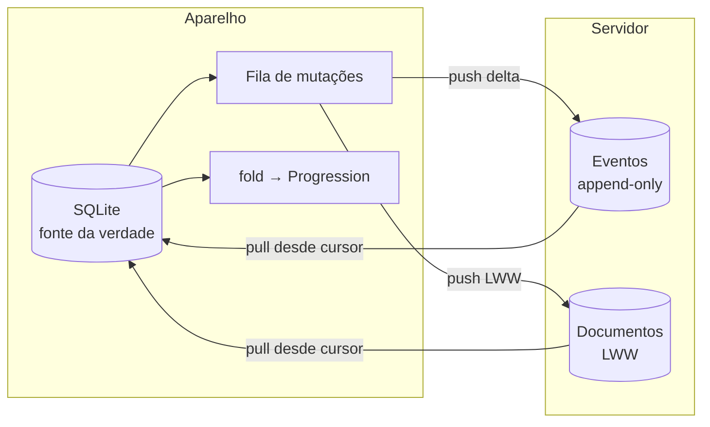
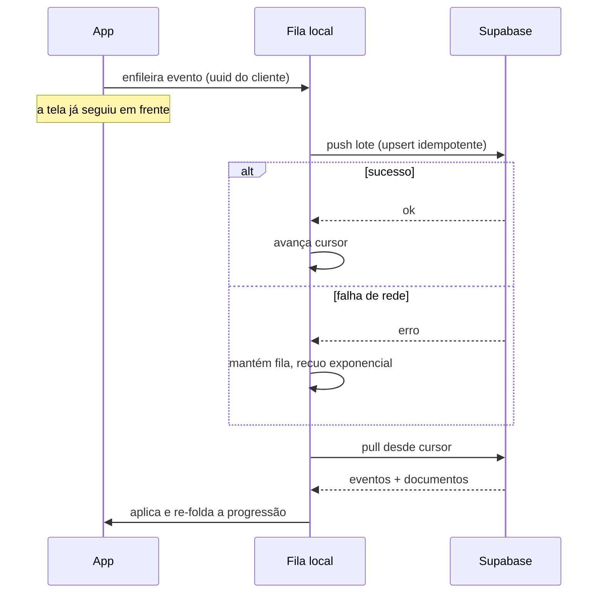

# Design — Backend e sincronização

**Requisitos:** `.kiro/specs/arise-backend/requirements.md`

---

## 1. A decisão que define tudo: progressão é derivada, não sincronizada

O caminho óbvio seria sincronizar `Progression` — nível, XP, rank, sequência —
como um registro mutável. É também o caminho que produz conflitos insolúveis:
dois aparelhos treinam offline no mesmo dia, ambos incrementam XP, e não existe
merge correto entre "nível 14 com 4.915 XP" e "nível 14 com 5.100 XP". Somar
duplica, escolher um perde treino.

**Progressão é um fold sobre o log de eventos.**

```
progression = fold(applyEvent, initialState, sortedEvents)
```

Tudo que altera progressão já é um fato datado e imutável: uma sessão concluída,
uma Zona de Penalidade cumprida, uma pedra usada, um benchmark aprovado. Eventos
não conflitam — eles se unem. Dois aparelhos que viram o mesmo conjunto de
eventos chegam ao mesmo estado, em qualquer ordem de chegada (B2.4).

Consequências, todas boas:

| | |
|---|---|
| Conflito de progressão | Deixa de existir |
| Reenvio duplicado | No-op, porque o id vem do cliente (B2.5) |
| Bug no cálculo de XP | Corrigível com um re-fold; o histórico é a verdade |
| Auditoria | "Por que subi de nível?" tem resposta exata |
| Servidor | Guarda fatos, não estado de jogo — e fatos não precisam de lógica de negócio no servidor |

O custo é que `fold` roda sobre o histórico inteiro. Com uma sessão a cada dois
dias, são ~180 eventos por ano — irrelevante. Se um dia deixar de ser, entra
snapshot periódico com re-fold a partir dele.

### O que continua sendo documento mutável

Perfil, triagem e a missão do dia em andamento. São de baixa frequência e de um
usuário só, então última escrita por `updated_at` resolve (B2.6), com desempate
determinístico por `device_id` (B2.7).



---

## 2. Stack

Supabase — Postgres, Auth e Storage — conforme §16 do product brief.

O que pesa na escolha: autenticação pronta (inclusive Sign in with Apple, que a
App Store exige), **row-level security no banco** em vez de checagem de
permissão espalhada pela aplicação, e migrations que são SQL sob controle de
versão. Escrever autenticação própria neste estágio seria erro.

RLS é o ponto central para nós: dado de saúde protegido por política no banco
falha fechado. Um bug de API não vaza linha de outro usuário, porque o banco
recusa.

---

## 3. Schema

`supabase/migrations/0001_schema.sql` e `0002_rls.sql`.

### Eventos — append-only, id gerado no cliente

| Tabela | Fato |
|---|---|
| `sessions` | Sessão de treino concluída |
| `set_logs` | Série individual dentro de uma sessão |
| `penalty_events` | Zona de Penalidade cumprida ou perdida |
| `stone_events` | Pedra de Recuperação concedida ou usada |
| `injury_events` | Lesão declarada ou alta |
| `benchmarks` | Reavaliação de rank |
| `shadow_unlocks` | Sombra extraída |
| `pain_log` | Registro de dor articular ou muscular |
| `body_metrics` | Peso, cintura |

Chave primária é o `id` UUID vindo do cliente. `INSERT ... ON CONFLICT DO
NOTHING` torna o reenvio idempotente (B2.5).

### Documentos — mutáveis, LWW

| Tabela | Conteúdo |
|---|---|
| `profiles` | Perfil, preferências, idioma, tom do Sistema |
| `health_screenings` | PAR-Q+ datado, com validade de 12 meses |
| `daily_quests` | Missão do dia e progresso parcial |

Cada um carrega `updated_at` e `updated_by_device`.

### Guildas

`guilds`, `guild_members`, `guild_raids`. A leitura entre membros passa por uma
**view** que expõe só nome de caçador, rank, nível, sequência e conclusões do
dia (B4.3) — dado de saúde não está na view, então não há o que vazar por
engano (B4.4).

---

## 4. Segurança em nível de linha

Toda tabela: `ENABLE ROW LEVEL SECURITY`, sem política permissiva padrão.
Negar por omissão (B5.2).

```sql
create policy "own rows" on sessions
  for all using (user_id = (select auth.uid()))
  with check (user_id = (select auth.uid()));
```

`(select auth.uid())` em vez de `auth.uid()` é intencional: o Postgres avalia
a subquery uma vez por consulta em vez de uma vez por linha, o que muda a
performance em tabela grande.

Para guildas, a política checa participação:

```sql
create policy "guild members read roster" on guild_members
  for select using (
    guild_id in (select guild_id from guild_members where user_id = (select auth.uid()))
  );
```

**Teste de política é obrigatório** (B6.3): para cada tabela, um teste que
autentica como usuário A e confirma que ler linha de B devolve zero linhas —
não erro, zero linhas, que é como RLS se comporta. Política sem teste de acesso
cruzado é política que não existe.

---

## 5. Protocolo de sincronização

Delta bidirecional com cursor.

**Push.** A fila local guarda mutações em ordem. Cada lote envia eventos (upsert
idempotente) e documentos (LWW). O cursor só avança com confirmação do
servidor (B3.6) — se o app morrer no meio, o lote é reenviado e os eventos
repetidos viram no-op.

**Pull.** `updated_at > cursor`, paginado. Eventos entram no log local;
documentos passam por `mergeDocument`. Ao fim, `fold` recalcula a progressão.

**Nunca no caminho crítico.** A sincronização roda em segundo plano e é sempre
cancelável. Uma sessão de treino não espera rede, em nenhuma hipótese (B3.2) —
é a mesma regra que rege o app inteiro.



---

## 6. Onde o código mora

```
supabase/
├── migrations/
│   ├── 0001_schema.sql
│   └── 0002_rls.sql
└── seed.sql

src/core/sync/
├── events.ts      # união de eventos do domínio
├── fold.ts        # ⚠️ TS puro: eventos → Progression
├── merge.ts       # ⚠️ TS puro: LWW de documentos
├── queue.ts       # fila de mutações, persistente
└── client.ts      # Supabase; a única parte que fala rede
```

`fold.ts` e `merge.ts` são puros pela mesma razão que o motor é: são testáveis
exaustivamente, e é neles que um erro custa o histórico de treino de alguém.

**Teste de propriedade obrigatório:** embaralhar a ordem de chegada de um
conjunto de eventos produz exatamente a mesma `Progression` (B2.4). É o que
garante que dois aparelhos convergem.

---

## 7. O que este design não resolve

- **Colaboração em tempo real.** Não é um editor de texto; latência de
  sincronização de segundos é aceitável.
- **Sincronização de conteúdo do catálogo.** Exercícios e sombras são estáticos
  e viajam no app, não no banco.
- **Servidor autoritativo contra trapaça.** O cliente é confiável para relatar
  o próprio treino. Não há ranking global para defender (B4.6), então
  antifraude seria custo sem benefício.
