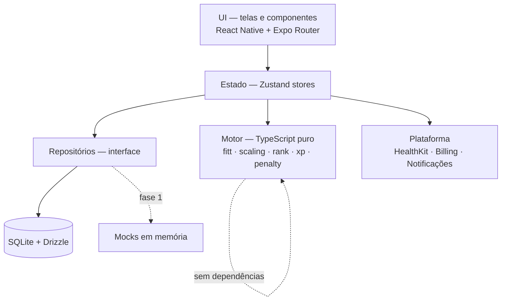
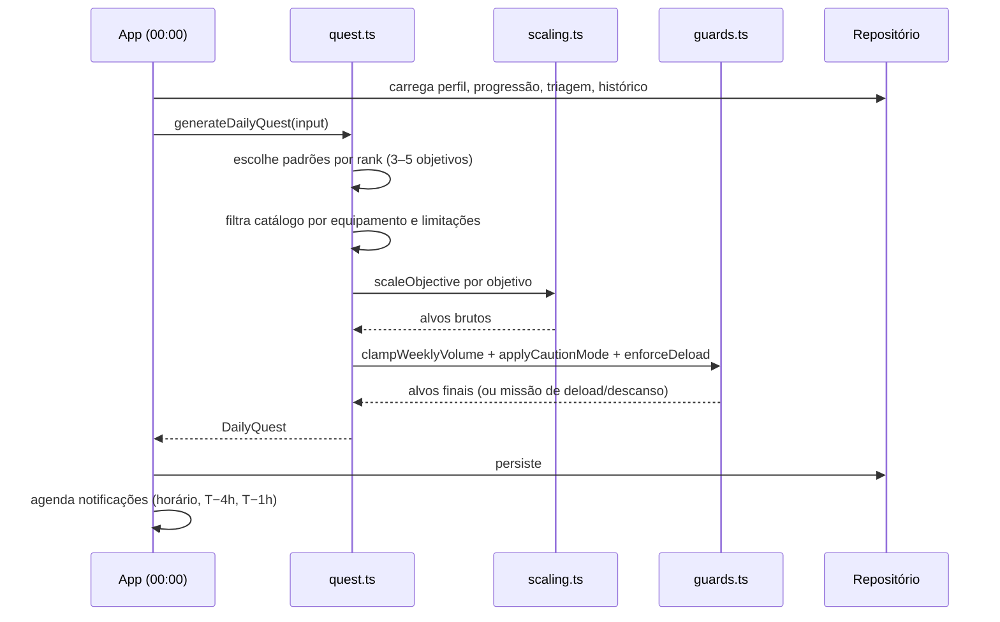
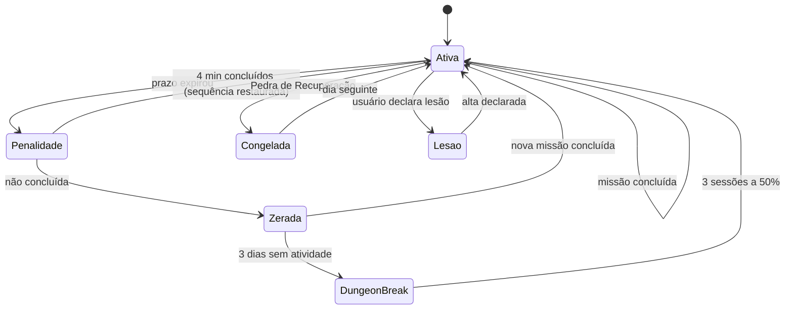

# Design técnico — Arise MVP

**Requisitos:** `.kiro/specs/arise-mvp/requirements.md`
**Contexto de produto:** `docs/product-brief.md`

---

## 1. Visão da arquitetura

Três camadas, com uma regra que governa tudo: **o motor não conhece React, nem banco, nem plataforma.**



O motor recebe estado e devolve estado. Não lê banco, não dispara efeito, não importa nada de `react` ou `expo`. É isso que torna possível testá-lo exaustivamente — e a §R15 exige exatamente isso, porque um bug de escalonamento aqui causa lesão, não tela feia.

### Por que repositórios por interface

O MVP começa **sem dados reais** (dados mockados, sem API). Definindo `ExerciseRepository`, `QuestRepository` etc. como interfaces, a fase 1 injeta uma implementação em memória e a fase 2 injeta a implementação SQLite **sem tocar em UI nem em motor**. É a diferença entre trocar uma origem de dados e reescrever o app.

---

## 2. Estrutura de pastas

```
app/                                 # rotas — Expo Router
├── (onboarding)/
│   ├── despertar.tsx · biometria.tsx · triagem.tsx
│   ├── baseline.tsx · logistica.tsx · contrato.tsx
├── (tabs)/
│   ├── index.tsx        # Status
│   ├── missao.tsx · codice.tsx · exercito.tsx
├── sessao/[questId].tsx # execução
├── penalidade.tsx · reavaliacao.tsx · paywall.tsx
└── _layout.tsx

src/
├── core/
│   ├── engine/          # ⚠️ TS puro, sem React/IO
│   │   ├── xp.ts           calcXp · xpForLevel · applyXp
│   │   ├── scaling.ts      scaleObjective · progressionFactor · readinessFactor
│   │   ├── rank.ts         evaluateBenchmark · rankCriteria · initialRank
│   │   ├── quest.ts        generateDailyQuest
│   │   ├── attributes.ts   deriveAttributes
│   │   ├── penalty.ts      penaltyState · streakTransition · dungeonBreak
│   │   ├── energy.ts       mifflinStJeor · tdee
│   │   ├── screening.ts    evaluateParq · restrictionsFor
│   │   └── guards.ts       ⚠️ tetos invioláveis — R15
│   ├── repositories/    # interfaces + impl mock + impl sqlite
│   ├── db/              # schema Drizzle + migrations
│   └── i18n/            # i18next, namespaces
├── features/            # onboarding · quest · progression · exercises · shadows · billing
├── ui/                  # SystemWindow · SystemText · StatBar · RadarChart · tokens
└── data/
    ├── exercises.ts · programs.ts · shadows.ts
    └── mocks/           # estado de demonstração
```

---

## 3. Modelo de dados

Tipos do domínio (os mesmos na fase mock e na fase SQLite — essa identidade é o ponto):

```ts
type Rank = 'E' | 'D' | 'C' | 'B' | 'A' | 'S' | 'NATIONAL';
type Pattern = 'push_h' | 'push_v' | 'pull_h' | 'pull_v' | 'squat'
             | 'hinge' | 'unilateral' | 'core_anti_ext' | 'core_anti_rot'
             | 'trunk_flex' | 'carry' | 'aerobic' | 'mobility';
type Attribute = 'STR' | 'AGI' | 'VIT' | 'PER' | 'INT';

interface UserProfile {
  hunterName: string;
  birthYear: number;
  gender: 'male' | 'female' | 'unspecified' | 'custom';
  goal: 'fat_loss' | 'strength' | 'health' | 'habit';
  daysPerWeek: 2 | 3 | 4 | 5;
  sessionMinutes: 10 | 20 | 30 | 45;
  preferredTime: string;          // "19:00"
  location: 'home' | 'gym' | 'outdoor';
  equipment: Equipment[];
  limitations: Limitation[];
  units: { mass: 'kg' | 'lb'; length: 'cm' | 'ft' };
  locale: 'pt-BR' | 'en-US';
  systemTone: 'cold' | 'companion';
}

interface Progression {
  level: number; xp: number; rank: Rank;
  attributes: Record<Attribute, number>;
  unspentPoints: number;
  streakCurrent: number; streakBest: number;
  recoveryStones: number;
}

interface Exercise {
  id: string; slug: string;
  namePt: string; nameEn: string;
  systemNamePt: string; systemNameEn: string;
  pattern: Pattern; difficulty: number;    // 1–10
  minRank: Rank;
  equipment: Equipment[];
  contraindications: Limitation[];
  regressionId: string | null;
  progressionId: string | null;
  cues: string[];            // 3 pontos-chave
  commonErrors: string[];
  illustrations: { start: string; end: string } | null;
  progressionCriteria: string;
  attribute: Attribute;
}

interface DailyQuest {
  id: string; date: string; rank: Rank;
  objectives: QuestObjective[];
  status: 'pending' | 'partial' | 'completed' | 'failed';
  deadline: string; isDeload: boolean;
  xpAwarded: number | null;
}

interface QuestObjective {
  exerciseId: string;
  targetValue: number;
  unit: 'reps' | 'seconds' | 'minutes' | 'meters';
  actualValue: number;
  rpe: 3 | 5 | 7 | 9 | null;   // ponto médio da faixa
  formOk: boolean | null;
  completedAt: string | null;
}

interface HealthScreening {
  date: string;
  answers: Record<string, boolean>;
  result: 'cleared' | 'caution' | 'blocked';
  restrictions: Limitation[];
  expiresAt: string;           // +12 meses — R2.7
}
```

Tabelas SQLite (fase 2) espelham esses tipos 1:1 — ver §17 do product brief.

---

## 4. O motor

### 4.1 Contratos

Funções puras. Mesma entrada, mesma saída, sempre.

```ts
// xp.ts
function calcXp(session: SessionSummary, streak: number): number;
function xpForLevel(level: number): number;          // 100 × N^1.45
function applyXp(prog: Progression, xp: number): Progression;

// scaling.ts
function scaleObjective(base: number, ctx: ScalingContext): number;
function progressionFactor(history: SessionSummary[]): number;
function readinessFactor(vit: number, sleep: number, soreness: number): number;

// quest.ts
function generateDailyQuest(input: {
  profile: UserProfile; progression: Progression;
  screening: HealthScreening; history: SessionSummary[];
  date: string; catalog: Exercise[];
}): DailyQuest;

// guards.ts  ⚠️
function clampWeeklyVolume(proposed: number, lastWeek: number): number;
function assertCanonicalAllowed(rank: Rank, singleSession: boolean): GuardResult;
function applyCautionMode(quest: DailyQuest, s: HealthScreening): DailyQuest;
```

### 4.2 Os guardas (R15)

`guards.ts` é o último ponto por onde toda missão passa antes de sair do motor. Nenhum caminho de código pode contorná-lo.

| Guarda | Regra | Requisito |
|---|---|---|
| `clampWeeklyVolume` | Teto duro de +10%/semana | R4.5 |
| `assertCanonicalAllowed` | 300 reps + 10 km só a partir do Rank A; sessão única exige aviso de rabdomiólise | R15.2–4 |
| `applyCautionMode` | Modo Prudência: teto RPE 5, só caminhada/mobilidade/força leve, rank travado em D | R2.5 |
| `enforceDeload` | Toda 4ª semana, −40%, não pulável | R4.8–9 |
| `dropPainfulPattern` | 2 registros de dor articular no mesmo padrão → padrão sai do plano | R15.5 |

**Teste obrigatório:** cada guarda tem um teste que tenta burlá-lo por entrada maliciosa. Um guarda sem teste de violação é um guarda que não existe.

### 4.3 Geração da Missão Diária



### 4.4 Sequência e penalidade



Nível, Rank, atributos e histórico **não participam desta máquina**. Nenhuma transição os toca (R8.5).

---

## 5. Camada de UI

### 5.1 Componentes assinatura

| Componente | Descrição |
|---|---|
| `<SystemWindow>` | Moldura 1px roxo claro, cantos **chanfrados via clip-path** (nunca arredondados), fundo `#150C2B`, brilho externo. Variantes: `default` (roxo), `highlight` (azul), `alert` (vermelho) |
| `<SystemText>` | Mensagem do Sistema com efeito de digitação, pulável ao toque, respeitando `prefers-reduced-motion` |
| `<StatBar>` | Barra de progresso de XP / objetivo |
| `<RadarChart>` | Pentágono SVG dos 5 atributos |
| `<RankBadge>` | Selo de rank, tamanhos sm/md/lg |
| `<RepCounter>` | Contador tocável, alvo ≥ 44pt, haptic por toque |
| `<Wordmark>` | **Único lugar onde o nome do app aparece** — ver steering/tech.md |

### 5.2 Tokens

Fonte única em `src/ui/tokens.ts`. Nenhum hex solto em componente.

```ts
export const color = {
  bg: '#0C0618', surface: '#150C2B', surfaceAlt: '#100822',
  purple: '#7C3AED', purpleLight: '#A78BFA', purpleSoft: '#C4B5FD',
  blue: '#7DD3FC',
  red: '#FF3B5C', redText: '#FF6B85',
  gold: '#FBBF24', green: '#4ADE80',
  text: '#F3EFFF', textDim: '#ADA2CC', textMuted: '#8A7EAE',
  line: 'rgba(139,92,246,0.30)',
} as const;
```

**Regra de cor:** roxo carrega a interface, azul claro marca dado, vermelho só onde há urgência ou risco real. Verde só "concluído", dourado só Rank S / General.

### 5.3 Acessibilidade

Não é polimento — é requisito, porque o usuário interage suado, ofegante e com o celular no chão.

- Contraste mínimo 4.5:1 para texto (3:1 acima de 24px).
- Alvos de toque ≥ 44pt em toda a execução de sessão.
- `prefers-reduced-motion` desliga glitch, partículas e digitação.
- Rótulos de leitor de tela em todo contador de repetição.
- Escala de fonte dinâmica respeitada.

---

## 6. Estratégia de dados mockados (fase 1)

O MVP de front usa dados mockados e nenhuma API. Para que isso não vire dívida:

1. **Os mocks obedecem aos tipos do domínio**, não a formatos inventados por tela.
2. **`MockRepository` implementa a mesma interface** que `SqliteRepository` vai implementar.
3. **A injeção acontece num único lugar** — `src/core/repositories/index.ts` exporta a implementação ativa por flag.
4. **O motor roda de verdade sobre os mocks.** A Missão Diária da tela de Status é gerada por `generateDailyQuest`, não escrita à mão. Isso testa o motor desde o primeiro dia e garante que as telas recebam dados com a forma real.

Estado de demonstração: caçador no Rank D, nível 14, sequência de 23 dias, 14 sombras — o mesmo do mock visual, para comparação direta.

---

## 7. Tratamento de erros

| Situação | Comportamento |
|---|---|
| Sem rede durante sessão | Nada acontece. A sessão nunca depende de rede (R5.2) |
| Validação de assinatura falha por rede | 72h de tolerância antes de bloquear (R13.8) |
| Banco corrompido | Oferecer restauração do backup em nuvem; nunca iniciar do zero silenciosamente |
| Migração de schema falha | Backup automático antes de migrar; rollback e aviso |
| HealthKit/Health Connect negado | App funciona com entrada manual de passos, sem degradação de fluxo |
| Motor recebe estado inválido | Lança erro tipado, registrado no Sentry sem dado de saúde; UI cai para a missão do dia anterior |

**Princípio:** nenhuma falha pode impedir o usuário de treinar. Toda degradação é graciosa e mantém a Missão Diária acessível.

---

## 8. Testes

| Camada | Ferramenta | Cobertura-alvo |
|---|---|---|
| `core/engine` | Vitest | **≥ 90%** — é o requisito de segurança |
| `core/engine/guards.ts` | Vitest | **100% + teste de violação por guarda** |
| Repositórios | Vitest | Contrato idêntico entre mock e sqlite |
| Componentes de UI | Testing Library | Fluxos críticos: execução de sessão, paywall, triagem |
| Fluxo completo | Maestro | Onboarding → primeira missão → conclusão |

**Teste de propriedade obrigatório:** para qualquer histórico gerado aleatoriamente, `clampWeeklyVolume` nunca produz aumento acima de 10%. Este é o teste que impede uma lesão.

---

## 9. O que este design deliberadamente não resolve

- **Sincronização entre aparelhos.** v1.2, com backend. No MVP, backup em nuvem cobre o caso de troca de celular (R12.3).
- **Guildas.** Estado compartilhado exige servidor; não existe versão offline.
- **Vídeo de exercício.** Substituído por par de ilustrações + cues (R11.3).
- **Módulo de nutrição.** Entrada visível e bloqueada com "em breve".
